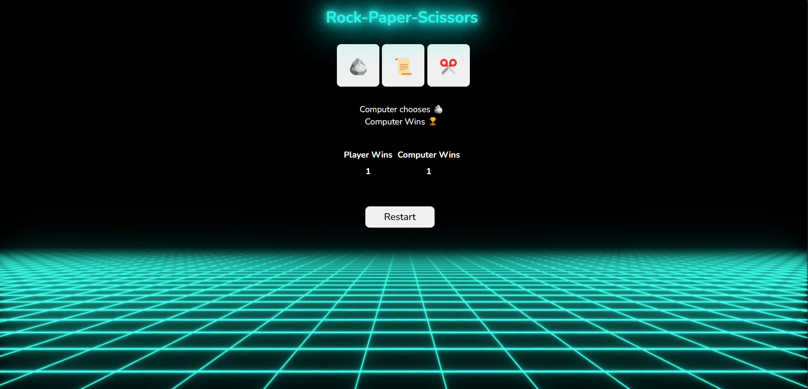

# Rock Paper Scissors

A simple and interactive Rock Paper Scissors game built using HTML, CSS, and JavaScript. This project demonstrates the basics of web development, including layout design, styling, and DOM manipulation.

## Features

- **Interactive Gameplay:** Play Rock, Paper, Scissors against the computer.
- **Dynamic UI:** Displays the choices and the result of each round.
- **Responsive Design:** Works seamlessly on both desktop and mobile devices.

## Technologies Used

- **HTML:** Structure of the webpage.
- **CSS:** Styling for the game layout and responsiveness.
- **JavaScript:** Game logic and interactivity.

## How to Play

1. Open the game in a web browser.
2. Click on your choice: Rock, Paper, or Scissors.
3. The computer will randomly select its choice.
4. The result of the round (win, lose, or draw) will be displayed.

## Project Structure

```
rock-paper-scissors/
├── index.html      # Main HTML file
├── style.css       # CSS for styling
└── script.js       # JavaScript for game logic
```

## Installation

1. Clone this repository:
   ```bash
   git clone https://github.com/yourusername/rock-paper-scissors.git
   ```
2. Navigate to the project folder:
   ```bash
   cd rock-paper-scissors
   ```
3. Open `index.html` in your preferred web browser.

## Game Logic

- **Rules:**
  - Rock beats Scissors
  - Scissors beats Paper
  - Paper beats Rock
- The game randomly selects the computer's choice using JavaScript's `Math.random()` function.
- A message is displayed indicating whether the player won, lost, or drew the round.

## Demo



## Future Improvements

- Add score tracking for multiple rounds.
- Include animations and sound effects.
- Add multiplayer functionality.

## Contributing

Contributions are welcome! If you have suggestions or want to improve the project, feel free to fork the repository and create a pull request.

## License

This project is licensed under the MIT License. See the `LICENSE` file for details.

## Acknowledgments

- Inspired by the classic Rock Paper Scissors game.
- Thanks to open-source resources and tutorials for guidance.

